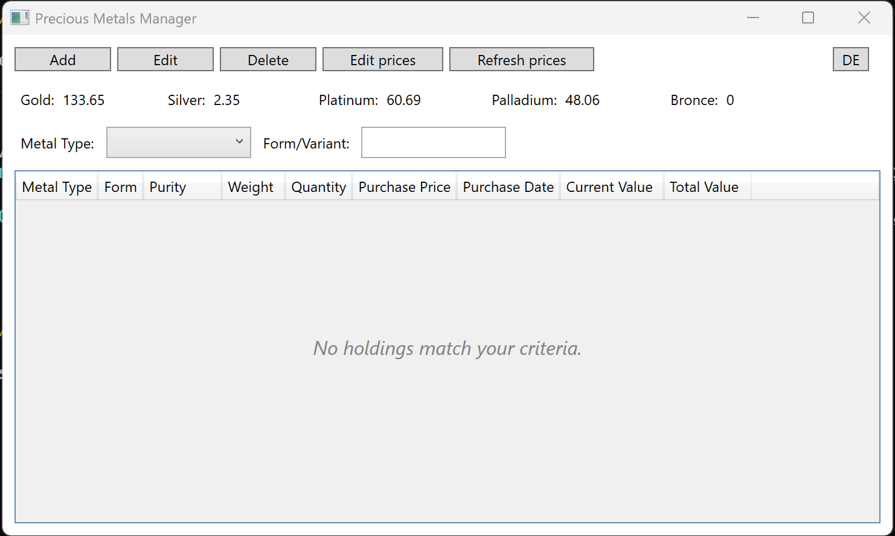
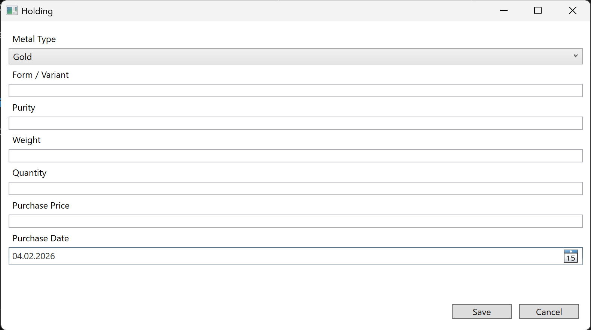
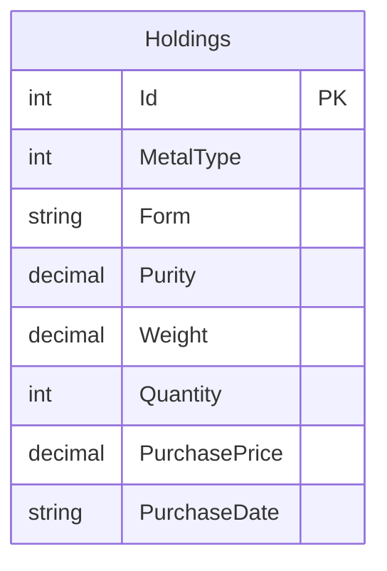
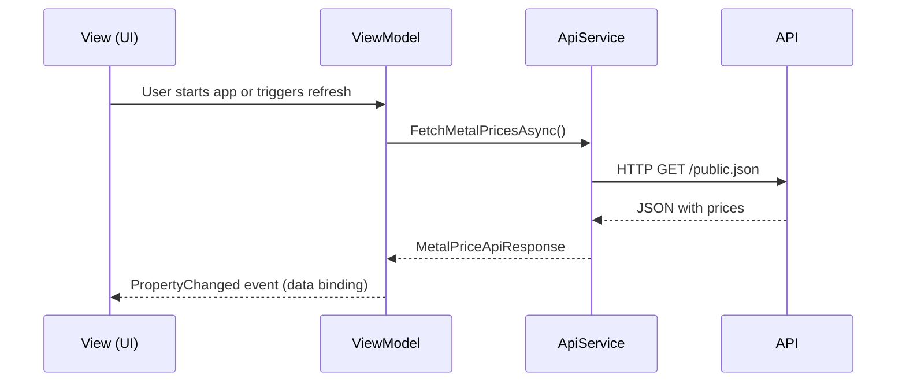

# Precious Metals Manager

Precious Metals Manager is a modern WPF desktop application designed for individuals who want to efficiently track and manage their personal holdings of gold, silver, platinum and other precious metals. The application uses SQLite for local data storage, provides an intuitive interface for managing assets, supports multi-language localization (German and English) and integrates live market price APIs. Built with the MVVM pattern and .NET 10, it offers a robust and maintainable solution for managing precious metal portfolios.

## Technologies Used
- .NET 10 
- SQLite 
- GNU Make 

## User Interface Preview

**Main Window**  
_Overview of the main application window with controls for adding, editing and viewing precious metal holdings._  
<br><br>

**Add/Edit Holding Dialog**  
_Dialog for entering or editing the details of a precious metal holding._  
<br><br>

**Edit Metal Prices Dialog**  
_Dialog for manually updating the current market prices for each metal._  


## Overview

Refer to `docs/00-project-overview.md` for the full project overview.

## Important Conventions
- The highest possible purity for precious metals is considered to be 999.9.
- One troy ounce is treated as a rounded value of 31.1 grams.

## Getting Started

Follow these steps to set up and run Precious Metals Portfolio Manager on your machine:

1. **Install prerequisites:**
   - [.NET SDK 10.0 or newer](https://dotnet.microsoft.com/download)
   - [GNU Make](https://www.gnu.org/software/make/) (on Windows, install via Chocolatey: `choco install make`)

2. **Clone the repository:**
   ```sh
   git clone https://github.com/Moritz-Gluch/PreciousMetalsManager.git
   cd PreciousMetalsManager
   ```

3. **Restore dependencies:**
   ```sh
   make restore
   ```

4. **Build the project:**
   ```sh
   make build
   ```

5. **Run the application:**
   ```sh
   make run
   ```

6. **Run tests (optional):**
   ```sh
   make test
   ```

## Architecture Diagrams

### Database Structure



This diagram shows the single-table SQLite schema used to store all precious metal holdings.

### HTTP API Integration Diagram



## Features, Backlog & Tasks

For the current feature list, backlogs and tasks, see the [GitHub Issues](https://github.com/Moritz-Gluch/PreciousMetalsManager/issues) page.

## Build & Automation (Makefile)

A Makefile is included to automate building, testing, running, cleaning and formatting tasks for the codebase.

### Prerequisites
- .NET SDK 10.0 or newer
- GNU Make 

### Usage
Open a terminal in the project root and run:

- `make build`   Build the project in Release mode
- `make run`    Run the WPF application
- `make test`    Run all unit tests
- `make clean`   Clean build artifacts
- `make format`  Format code using dotnet-format
- `make restore`  Restore NuGet packages
