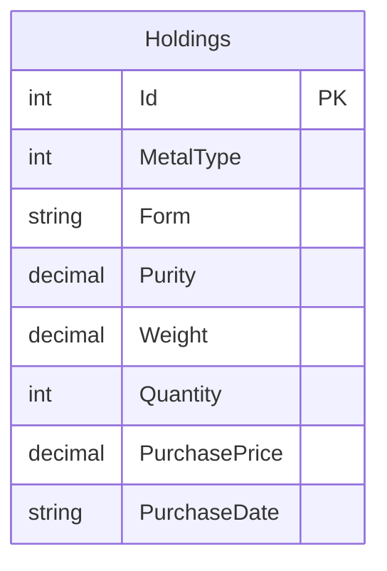
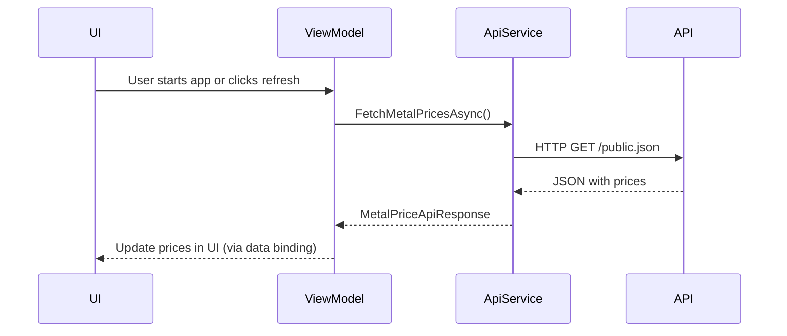

# Precious Metals Portfolio Manager

A WPF desktop application to manage personal precious metal holdings (gold, silver, platinum, etc.)

## Overview

Refer to `docs/00-project-overview.md` for the full project overview.

## Important Conventions
- The highest possible purity for precious metals is considered to be 999.9.
- One troy ounce is treated as a rounded value of 31.1 grams.

## Getting Started

Follow these steps to set up and run Precious Metals Portfolio Manager on your machine:

1. **Install prerequisites:**
   - [.NET SDK 10.0 or newer](https://dotnet.microsoft.com/download)
   - [GNU Make](https://www.gnu.org/software/make/) (on Windows, install via Chocolatey: `choco install make`)

2. **Clone the repository:**
   ```sh
   git clone https://github.com/Moritz-Gluch/PreciousMetalsManager.git
   cd PreciousMetalsManager
   ```

3. **Restore dependencies:**
   ```sh
   make restore
   ```

4. **Build the project:**
   ```sh
   make build
   ```

5. **Run the application:**
   ```sh
   make run
   ```

6. **Run tests (optional):**
   ```sh
   make test
   ```

For more details, see the documentation in the `docs/` folder.

## Backlog / Storys
Done (implemented):
- [STORY-01: CRUD for Precious Metals](docs/backlog/done/STORY-01-crud.md)
- [STORY-02: Display Holdings](docs/backlog/done/STORY-02-display.md)
- [STORY-03: Calculate Current Value](docs/backlog/done/STORY-03-calc-value.md)
- [STORY-04: Local Storage](docs/backlog/done/STORY-04-local-storage.md)
- [FEATURE-01: Implement Real Market Prices](docs/backlog/done/FEATURE-01-implement-real-marked-prices.md)
- [FEATURE-07: Localization (German and English)](docs/backlog/done/FEATURE-07-localization.md)
- [TASK-01: Create unit tests](docs/backlog/done/TASK-01-create-unit-tests.md)
- [TASK-02: Centralize Error Messages](docs/backlog/done/TASK-02-centralize-error-messages.md)
- [TASK-06: Change Date to European Format](docs/backlog/done/TASK-06-change-date-to-european-format.md)
- [DEFECT-01: Missplaced "no holdings" message](docs/backlog/done/DEFECT-01-missplaced-no-holdings-message.md)

Planned / Future:
- See `docs/backlog/future/`

## Build & Automation (Makefile)

A Makefile is included to automate building, testing, running, cleaning and formatting tasks for the codebase.

### Prerequisites
- .NET SDK 10.0 or newer
- GNU Make 

### Usage
Open a terminal in the project root and run:

- `make build`   Build the project in Release mode
- `make run`    Run the WPF application
- `make test`    Run all unit tests
- `make clean`   Clean build artifacts
- `make format`  Format code using dotnet-format
- `make restore`  Restore NuGet packages

## Architecture Diagram

Below is a simplified database structure for the Precious Metals Portfolio Manager:



This diagram shows the single-table SQLite schema used to store all precious metal holdings. For more details, see the technical documentation in the `docs/` folder.

## HTTP API Integration Diagram

The application fetches real-time metal prices from an external API. The following sequence diagram illustrates the HTTP API integration:



## Screenshots

<strong>Main Window</strong><br>
<br><br>

<strong>Add/Edit Holding Dialog</strong><br>
<br><br>

<strong>Edit Metal Prices Dialog</strong><br>

