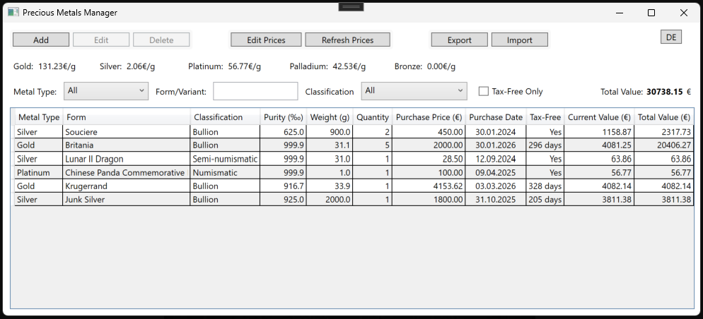
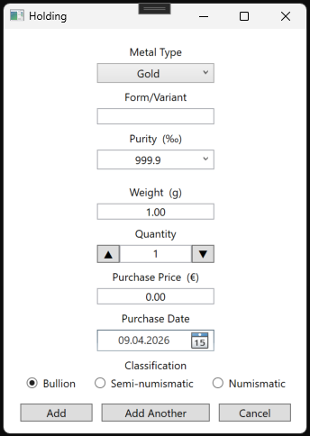
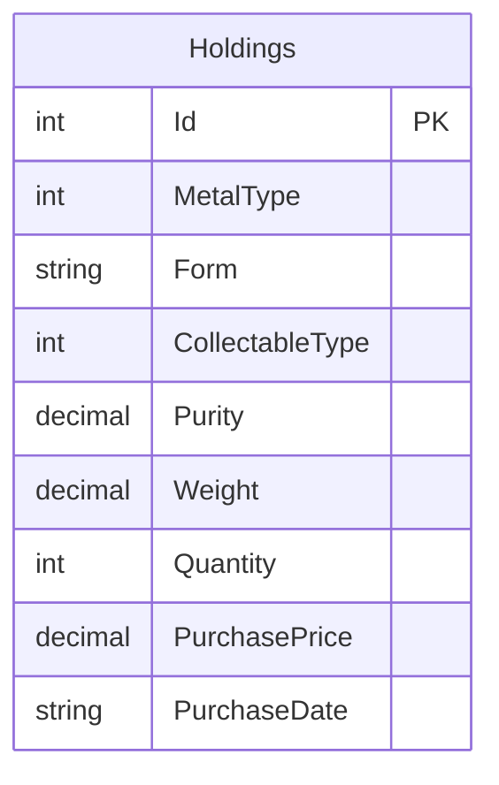
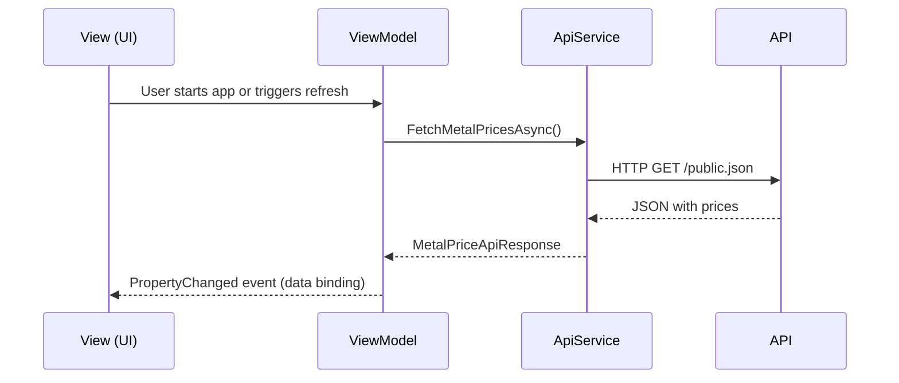

# Precious Metals Manager

Precious Metals Manager is a modern WPF desktop application for tracking personal holdings in gold, silver, platinum, palladium, and bronze. The application uses SQLite for local data storage, provides an intuitive interface for managing assets, supports multi-language localization (German and English), integrates an external market price API and offers CSV import/export functionality for both re-import and spreadsheet use. Built with the MVVM pattern and .NET 10, it offers a robust and maintainable solution for managing metal holdings.

For a complete end-user walkthrough with annotated screenshots, see the [User Guide](USER_GUIDE.md).

## Technologies Used
- WPF
- .NET 10 
- SQLite 
- MSTest
- GNU Make 

## User Interface Preview

**Main Window**  
_Overview of the main application window with controls for adding, editing and viewing precious metal holdings._  
<br><br>

**Add/Edit Holding Dialog**  
_Dialog for entering or editing the details of a precious metal holding._  
<br><br>

**Edit Metal Prices Dialog**  
_Dialog for manually updating the current market prices for each metal._  


## Overview

Refer to the [User Guide](USER_GUIDE.md) for the full end-user documentation and to [docs/00-project-overview.md](docs/00-project-overview.md) for the project overview.

## Important Conventions
- The highest possible purity for precious metals is considered to be 999.9.
- One troy ounce is treated as a rounded value of 31.1 grams.
- Bronze prices are maintained manually because they are not provided by the market price API.
- The import function is only suitable for files created with this program.

## Getting Started

Follow these steps to set up and run Precious Metals Manager on Windows:

1. **Install prerequisites:**
   - [.NET SDK 10.0 or newer](https://dotnet.microsoft.com/download)
   - [GNU Make](https://www.gnu.org/software/make/) (on Windows, install via Chocolatey: `choco install make`)

2. **Clone the repository:**
   ```sh
   git clone https://github.com/Moritz-Gluch/PreciousMetalsManager.git
   cd PreciousMetalsManager
   ```

3. **Restore dependencies:**
   ```sh
   make restore
   ```

4. **Build the project:**
   ```sh
   make build
   ```

5. **Run the application:**
   ```sh
   make run
   ```

6. **Run tests (optional):**
   ```sh
   make test
   ```

## Architecture Diagrams

### Database Structure


```mermaid
erDiagram
    Holdings {
        int Id PK
        int MetalType
        string Form
        int CollectableType
        decimal Purity
        decimal Weight
        int Quantity
        decimal PurchasePrice
        string PurchaseDate
    }
```

This diagram shows the single-table SQLite schema used to store all precious metal holdings.

### HTTP API Integration Diagram


```mermaid
sequenceDiagram
    participant UI as View (UI)
    participant VM as ViewModel
    participant ApiService
    participant API

    UI->>VM: User starts app or triggers refresh
    VM->>ApiService: FetchMetalPricesAsync()
    ApiService->>API: HTTP GET /public.json
    API-->>ApiService: JSON with prices
    ApiService-->>VM: MetalPriceApiResponse
    VM-->>UI: PropertyChanged event (data binding)
```

## Features, Backlog & Tasks

For the current feature list, backlog items and follow-up tasks, see the [GitHub Issues](https://github.com/Moritz-Gluch/PreciousMetalsManager/issues) page. Additional project, design and QA documentation is available in the [docs](docs) folder.

## Build & Automation (Makefile)

A Makefile is included to automate building, testing, running, cleaning and formatting tasks for the codebase.

### Prerequisites
- .NET SDK 10.0 or newer
- GNU Make 

### Usage
Open a terminal in the project root and run:

- `make build`    Build the project in Release mode
- `make run`      Run the WPF application
- `make test`     Run all unit tests after a successful build
- `make clean`    Clean build artifacts
- `make format`     Format code using dotnet-format
- `make restore`   Restore NuGet packages
