# Precious Metals Manager — User Guide

## Table of Contents

- [Precious Metals Manager — User Guide](#precious-metals-manager--user-guide)
  - [Table of Contents](#table-of-contents)
  - [Overview](#overview)
  - [Getting Started](#getting-started)
  - [Main Window](#main-window)
  - [Managing Holdings](#managing-holdings)
    - [Add a Holding](#add-a-holding)
    - [Edit a Holding](#edit-a-holding)
    - [Delete Holdings](#delete-holdings)
  - [Market Prices](#market-prices)
  - [Filters](#filters)
  - [Tax-Free Status](#tax-free-status)
  - [Holdings Table Columns](#holdings-table-columns)
  - [Export](#export)
    - [Simple Export](#simple-export)
    - [Detailed Export](#detailed-export)
  - [Import](#import)
  - [Language](#language)
  - [Data Storage](#data-storage)
  - [Conventions](#conventions)

---

## Overview

Precious Metals Manager is a desktop application for tracking precious metal holdings, monitoring market prices, and evaluating portfolio value. It currently supports **Gold**, **Silver**, **Platinum**, **Palladium** and **Bronze**.

The application is intended for day-to-day portfolio tracking. Holdings, prices, filters and language settings are designed to be easy to review and update through the user interface.

---

## Getting Started

1. Launch the application.
2. Market prices are fetched automatically on startup.
3. Click **Add** to create your first holding.
4. Use the filters above the table to narrow down visible entries if needed.

---

## Main Window

The main window is organized into four areas from top to bottom:
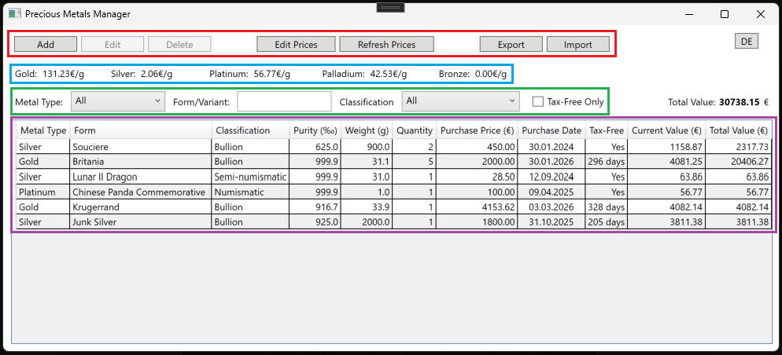

1. Toolbar — Buttons for managing holdings, prices and import/export.
2. Market Prices — Current price per gram for each metal type.
3. Filters — Filter the holdings table by metal type, form, classification or tax-free status. The **Total Value** of all currently visible holdings is displayed to the right.
4. Holdings Table — All holdings with calculated values. Click any column header to sort.

A language button in the top-right corner toggles between English and German.

---

## Managing Holdings

### Add a Holding

1. Click Add.
   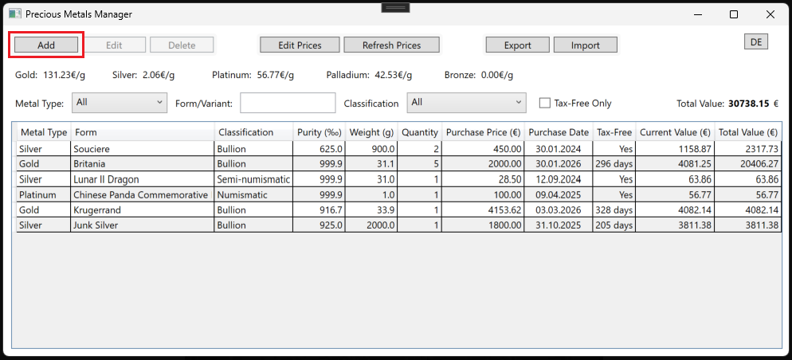
2. Fill in the holding details:
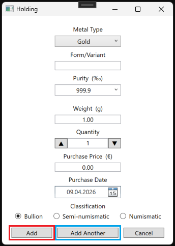  
   - **Metal Type** — Gold, Silver, Platinum, Palladium or Bronze.
   - **Form / Variant** — Free text, for example `1 oz Maple Leaf` or `10g Bar`.
   - **Purity (‰)** — Select a common value (`999.9`, `925.0`, `900.0`, `835.0`, `800.0`, `750.0`, `625.0`) or enter a custom value between `0.1` and `999.9`.
   - **Weight (g)** — Weight per piece in grams.
   - **Quantity** — Number of identical pieces.
   - **Purchase Price (€)** — Purchase price in EUR.
   - **Purchase Date** — Date of acquisition.
   - **Classification** — Bullion, Semi-numismatic or Numismatic.
1. Click Add to save and close.
2. Click Add another to save the current holding and immediately enter the next one.

### Edit a Holding

1. Select a holding in the table.
   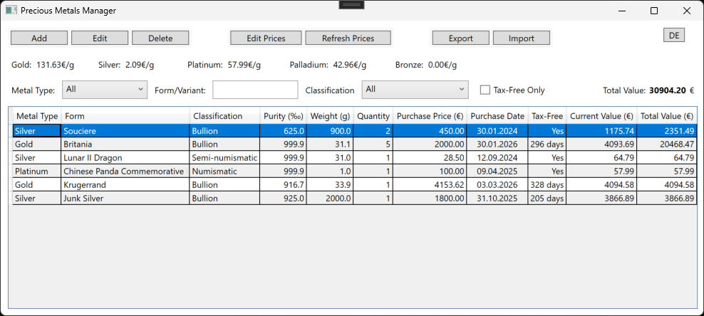
2. Click Edit.
   
3. Update the fields.
   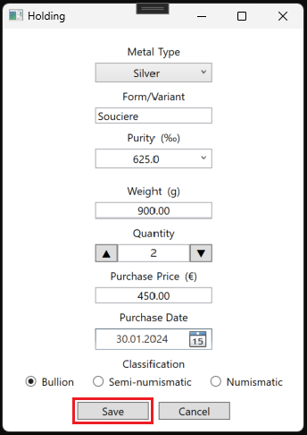  
4. Click Save.

### Delete Holdings

1. Select one or more holdings in the table.
   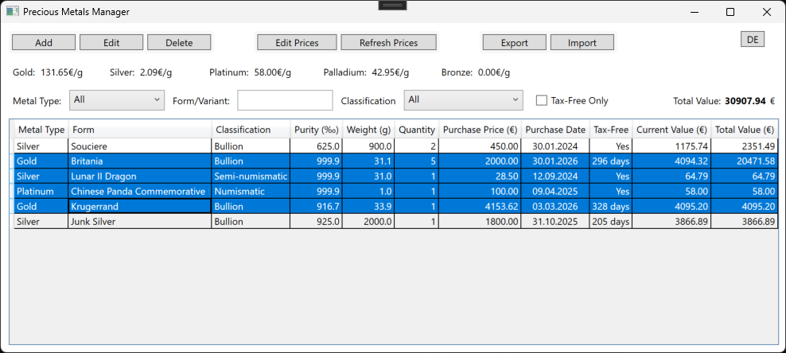
2. Click Delete.
   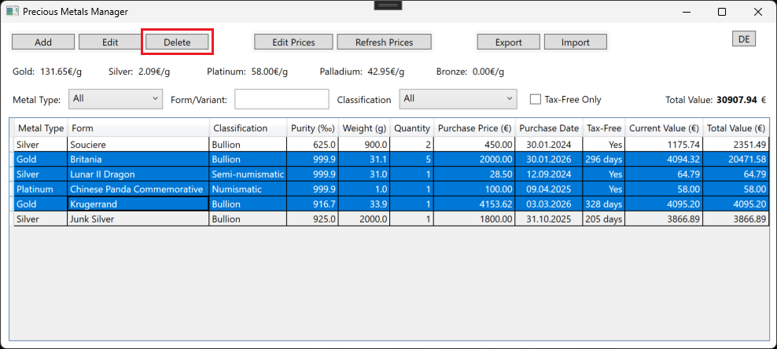
3. Confirm the deletion in the dialog.
   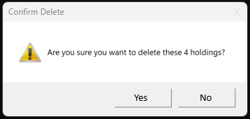

---

## Market Prices

Prices are displayed in **€/g** and are used to calculate the *Current Value* and *Total Value* columns.
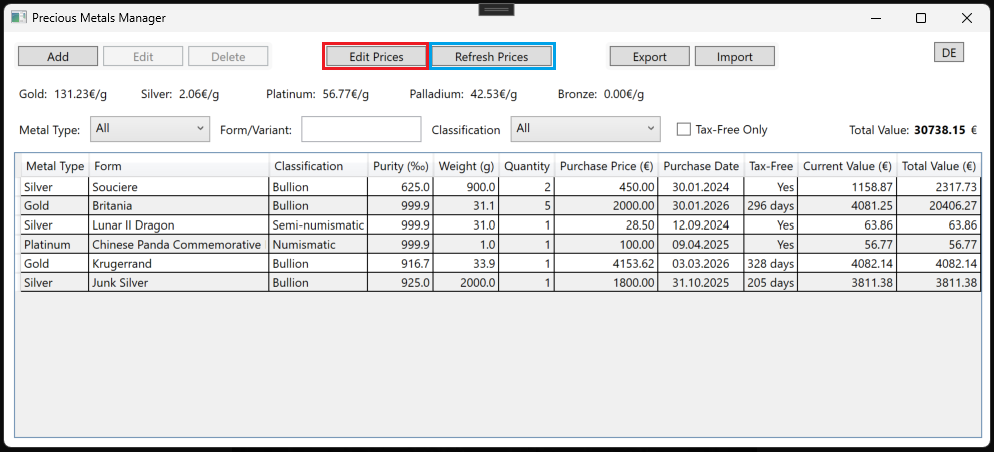

- Refresh prices — Fetches the latest market prices from an online API.
- Edit prices — Opens a dialog to manually set the price per gram for each metal type.
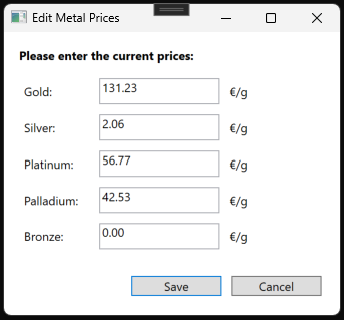

Prices are refreshed automatically on startup and again every **15 minutes**.

> **Note:** The API provides prices for Gold, Silver, Platinum and Palladium, based on troy-ounce values that are converted automatically using `1 troy ounce = 31.1 g`. **Bronze** prices are not available via the API and must be entered manually through **Edit prices**. Manually edited prices are applied immediately, but are not persisted across application restarts.

---

## Filters

Use the filter bar above the holdings table to narrow down visible entries.
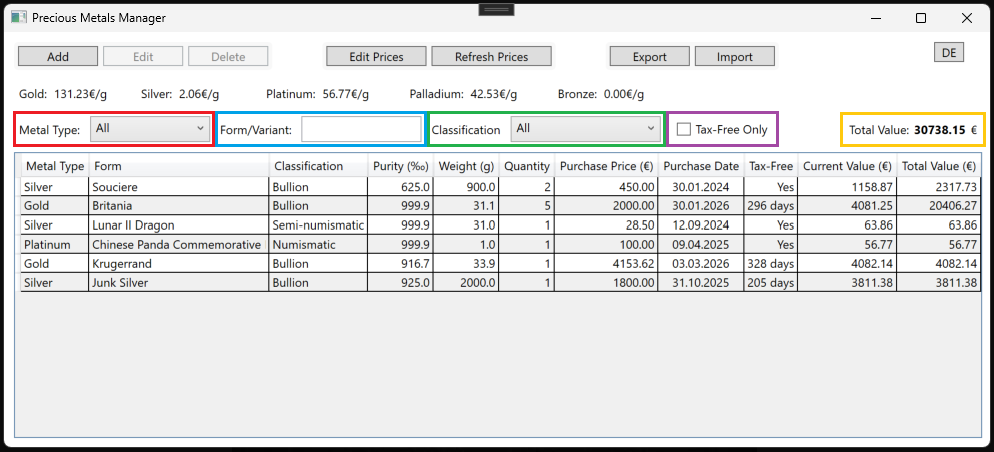

| Filter | Type | Description |
|---|---|---|
| Metal Type | Dropdown | Filter by a metal type that exists in the current holdings or *All*. |
| Form/Variant | Text | Free-text search within the form/variant column. |
| Classification | Dropdown | Filter by a classification that exists in the current holdings or *All*. |
| Tax-free only | Checkbox | Show only holdings that have reached the 1-year tax-free threshold. |

The Total Value shown next to the filters always reflects only the currently visible, filtered holdings.

If no holdings match the active filters, a hint message is shown instead of the table.
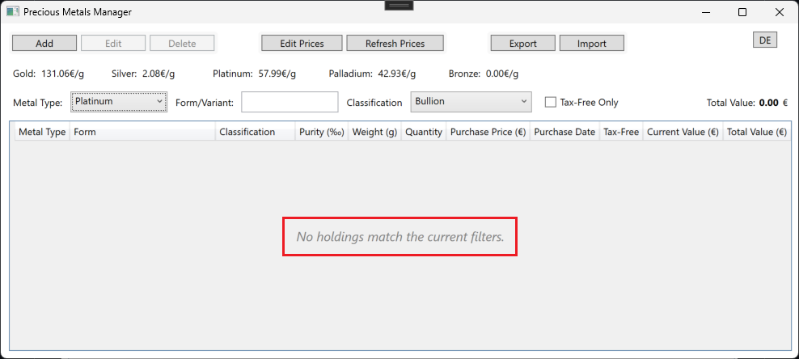

---

## Tax-Free Status

A holding is considered tax-free once it has been held for at least **1 year** from its purchase date.
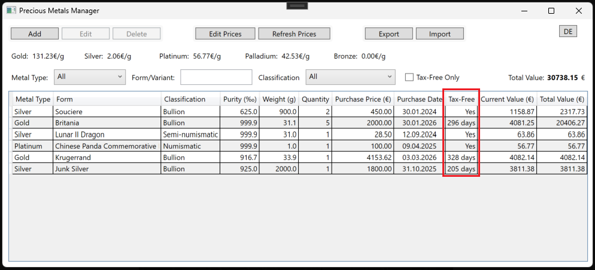
The *Tax-Free* column shows:

- **Yes** — The holding has reached the tax-free threshold.
- **X days** — The number of days remaining until the holding becomes tax-free.

The column is sortable. Sorting ascending shows already tax-free holdings first, followed by holdings with the fewest remaining days.

---

## Holdings Table Columns
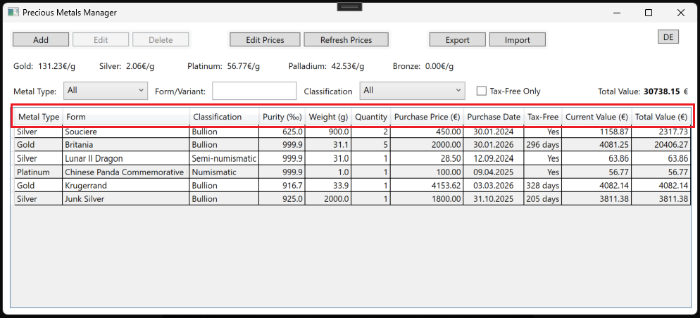

| Column | Description |
|---|---|
| Metal Type | Gold, Silver, Platinum, Palladium or Bronze. |
| Form | Name or description of the item, for example `1 oz Krugerrand`. |
| Classification | Bullion, Semi-numismatic, or Numismatic. |
| Purity (‰) | Fineness in permille, for example `999.9` for very pure metal. |
| Weight (g) | Weight per piece in grams. |
| Quantity | Number of identical pieces. |
| Purchase Price (€) | Price paid at time of purchase. |
| Purchase Date | Date of acquisition in `dd.MM.yyyy` format. |
| Tax-Free | Tax-free status or days remaining. |
| Current Value (€) | Per-piece market value: `Weight × (Purity ÷ 999.9) × Price per gram`. |
| Total Value (€) | Position value: `Current Value × Quantity`. |

All columns can be sorted by clicking the column header.

---

## Export

Click Export to open a menu with two export options.
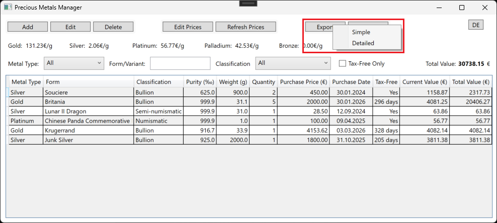

Both export options include **only the currently visible (filtered) holdings**, not the entire database.

### Simple Export

- Generates a semicolon-separated CSV **without** a header row.
- Uses a technical format intended for re-import.
- Uses enum indices and ISO date format `yyyy-MM-dd`.
- Default filename pattern: localized export label + date, for example `Export_10-04-2026.csv`.
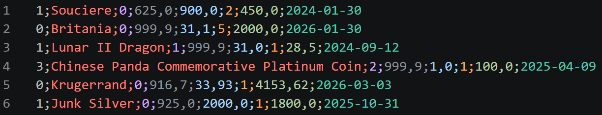

### Detailed Export

- Generates a semicolon-separated CSV **with** a localized header row.
- Uses human-readable labels in the current UI language.
- Dates are formatted as `dd.MM.yyyy`.
- Prices are formatted with two decimal places.
- Default filename pattern: localized export label + date + localized detailed suffix, for example `Export_10-04-2026_Detailed.csv`.
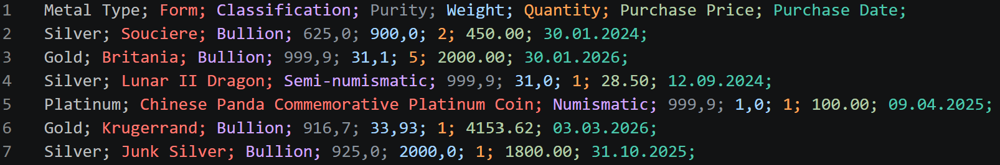

> **Tip:** Apply filters before exporting if only part of the portfolio should be included.

---

## Import

1. Click Import.
   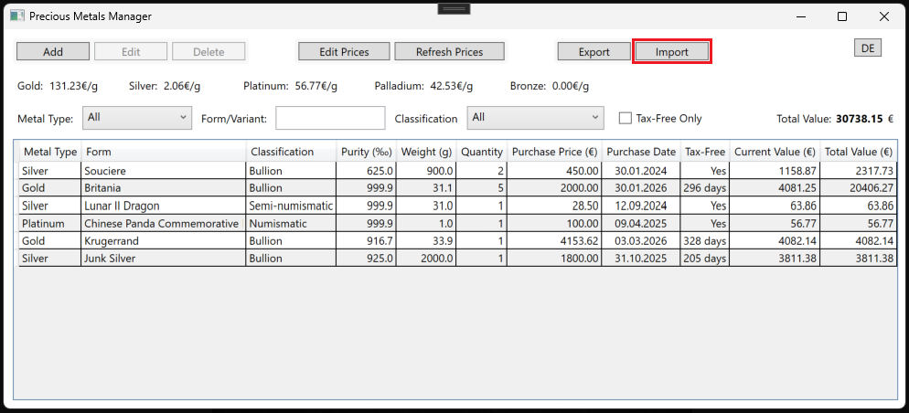
2. Select a `.csv` file in the **Simple Export** format.
3. If holdings already exist, choose whether to:
   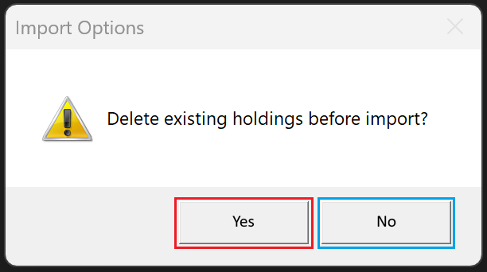
   - Delete all existing holdings before import, or
   - Append the imported holdings to the existing data.

> **Important:** Import is only intended for files created by this application through **Simple Export**. Detailed exports and externally created CSV files are not supported.

---

## Language

The button in the top-right corner switches the application language.

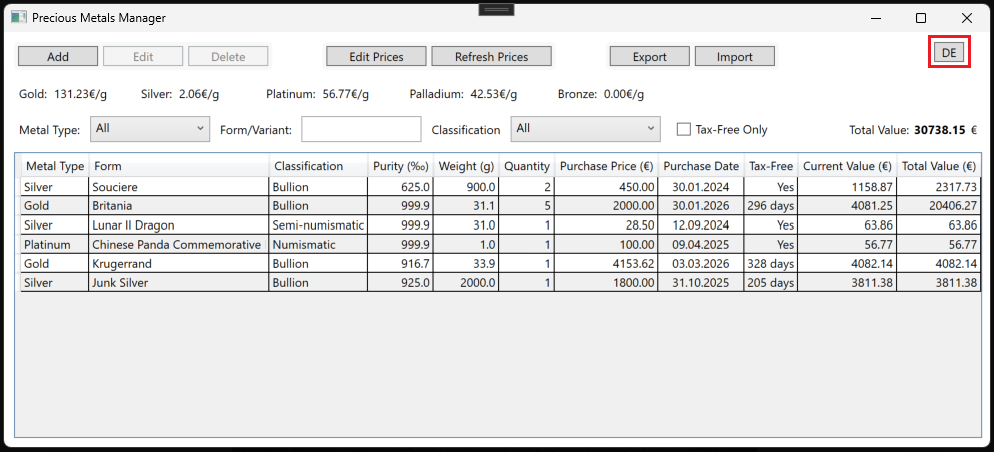

| Current language | Button label | Click to switch to |
|---|---|---|
| English | **DE** | German |
| German | **EN** | English |

All labels, column headers, and messages update immediately. The selected language is persisted across sessions.

---

## Data Storage

All holding data is stored locally in a SQLite database named `holdings.db`.

Changes to holdings are saved automatically when entries are added, edited, deleted or imported.

The language preference is stored separately in:

`%AppData%\PreciousMetalsManager\`

---

## Conventions

| Aspect | Convention |
|---|---|
| Currency | EUR (€) |
| Weight | Grams (g) |
| Purity | Permille (‰), maximum `999.9` |
| Troy ounce | Approx. `31.1 g` |
| Tax-free period | 1 year from purchase date |
| Price display | EUR per gram (`€/g`) |
| Import format | Only files created by this application via **Simple Export** |